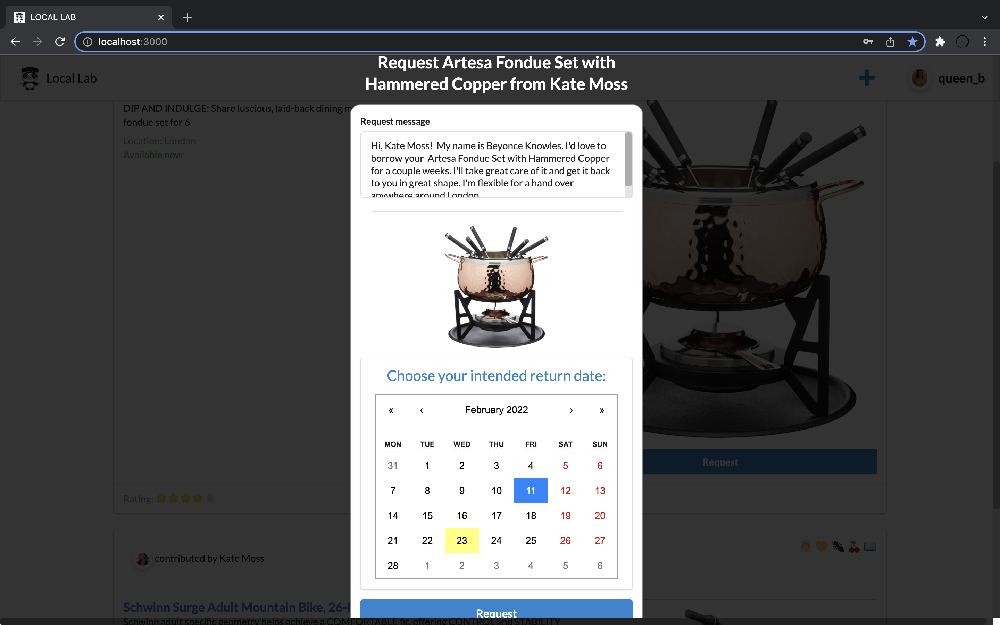
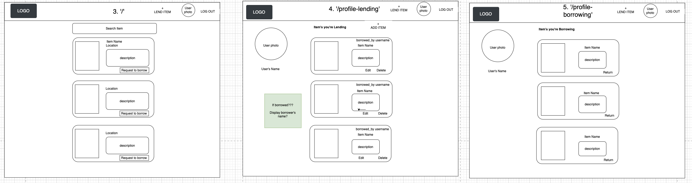

# LOCAL LAB

A local community free sharing app!
List and request items to lend and borrow the things you need from your local area.

## Undertaking

Developed a full-stack web application which provides a system for community members to lend and borrow items in a safe and efficient manner. The app implements the following features:

* Creating users
* Authenticating users
* Uploading user picture
* Creating items (lending)
* Listing/Unlisting items
* Uploading item pictures
* Editing items
* Searching for items
* Requesting items (borrowing)
* Approving borrow requests
* Returning items
* Confirming returns
* Signing Out
* Displaying alerts to confirm user actions

### Demo

[dwsdwsd](https://youtu.be/lnx5pY6V3Mo)

### Information Flow

Directed http requests from a front-end react app to a back-end RESTful API built on Express.js. The server retrieved/stored information in a MongoDB database, and sent back responses which were used by the hooks-based react application.

Used state and effect hooks to control the flow of information between components, and to conditionally render components for minimal reloading and enhanced user experience.

## Planning & Work-style

* Database diagramming (miro) - outlining initial database schemas

* Website mockups (diagrams.net) - outlining the general look of our app

* Trello - organizing, prioritizing and allocating tasks

* Daily stand-ups 10am, and retros 5pm (slack)
* Pair Programming - knowledge sharing, support
* Solo programming - deep learning, tackling multiple tasks in a short time

## Technologies

* MERN Stack

### Front End

* React - front-end framework
* React-router-dom - react app navigation
* React-calendar - pre-built calendar component
* Fomantic UI - CSS library
* Semantic UI React - Custom-Styled React Component Library
* Axios - HTTP request library

### Server

* Express.js - light-weight, unopinionated web framework
* multer - multipart/form-data (i.e. file upload) decryptor
* cloudinary - image storage

### Database

* MongoDB - document-oriented NoSQL database
* Mongo Atlas - hosted mongoDB production database
* Mongoose - ODM for

### Autentication

* Passport - password hashing and comparision with user input
* Passport JWT - issuance of JSON WEB TOKENS (based on public-key cryptography) used for user authorization purposes

### Testing

* Jest - JavaScript testing framework
* React Testing Library - React component testing library
* Mock Service Worker - API mocking library

### Deployment

* TBD

## Challenges & Solutions

**Learning a new tech stack**

* Taking time for solo learning and sharing good sources of information with the team
* Sharing information/pair programming with teammates who may have had previous experience with a certain technology
* Learn by doing - start coding by using what you know and then do more research/study when running into obstacles

**Changing from Django + React to MERN on Day-4**

* Recreating all API endpoints on express server and have them deal with axios requests appropriately
* Cutting some of the 'extras' tickets due to the reduction in time
* Using more npm packages (e.g. multer, morgan, cors) to compensate for the loss of several built-in (plug-and-play) features of Django

**Difficulty issuing JSON WEB TOKENS using passport JWT**

* Studying several hours of video and written information to understand the core principles public-key cryptography, which in turn made it easier to implement the tools which automated some of these processes.
* Understanding that even official documentation is incomplete/inaccurate sometimes; working as a team to pool multiple resources from across the web to get a complete understanding of the technology
* Console logging every step to find where/why the request is not being translated into the issuance of a JWT

**Accessing nested documents within the Mongo database**

* Focusing on using Mongoose syntax (instead of Mongo syntax) to take advantage of quick and simplified ways of retrieving nested data

**Unexpected and mysterious behaviours with React (e.g. updating item image leading to the update of profile picture..???)**

* Understanding that even though JSX feels very 'low-level' and 'manual', there is a lot of automation happening beneath the hood as it compiles down to regular html and javaScript
* Keeping code modular, sticking to SRP, and being mindful that seemingly separate process could be unexpectedly connected through props or shared component, helped to reduce some unexpected behaviours

## Potential Improvements & Extensions

* Using redux for state management allowing React to only be responsible for component rendering

* End-to-End testing using cypress library

* Implement additional features:

1. Adding a chat feature so users can communicate (e.g. set up a meeting spot in-app)
2. Adding a help/support section to help users with issues like disputes
3. Adding geolocation-based cluster map feature so users can find items by their geographical coordinates
4. Adding a badge system, so users are allocated badges based on good lending and borrowing behaviour
5. Adding a rating system for borrowers, so lenders can share their items with confidence

## Team (Alphabetical)

* [Evie Palaiochorinou](https://github.com/EviePalaiochorinou)
* [James Cort](https://github.com/j-cort)
* [Mayo Theodore](https://github.com/Mayo-Theodore)
* [Muhammad Choudhry](https://github.com/msc49)
* [Sabrina Lord](https://github.com/sabrinalord)